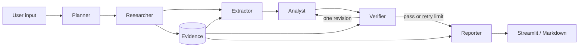
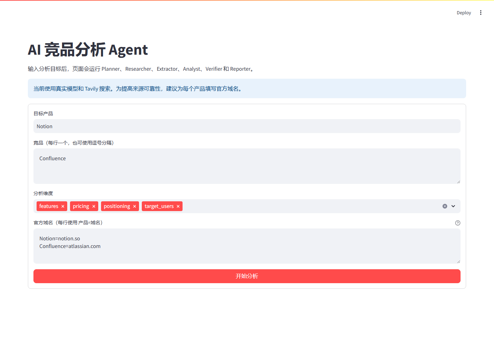

# Competitive Analysis Agent

一个使用 Python、Pydantic、LangGraph、LangChain 和 Streamlit 构建的 AI
竞品分析 Agent。项目已完成 Stage 0-11 的 MVP，并增加 Tavily 真实搜索 Provider
和本地后台日志，包括结构化规划、证据研究、产品画像提取、竞品分析、引用验证、
有限重试、Markdown 报告、网页界面和固定案例评测。

## Architecture



- `Planner` 把产品与维度拆成 `ResearchTask`。
- `Researcher` 调用可替换搜索接口，规范化来源并生成稳定 `Evidence ID`。
- `Extractor` 只根据 Evidence 生成带引用的 `ProductProfile`。
- `Analyst` 比较画像，并区分 `fact` 与 `interpretation`。
- `Verifier` 先用普通代码检查引用，再用模型检查语义支持与冲突。
- `Reporter` 确定性渲染 Markdown，不调用模型，也不添加新事实。
- LangGraph 保存共享 State，并允许 Verifier 最多把任务退回 Analyst 一次。

## Interface



当前页面已切换为“真实模型 + Tavily 搜索”，默认输入为：

```text
目标产品：Notion
竞品：Confluence
维度：features、pricing、positioning、target_users
官方域名：Notion=notion.so、Confluence=atlassian.com
```

产品、竞品和维度可以修改。官方域名采用 `产品=域名` 格式，用于限定搜索范围和
确定性标记官方来源。

## Measured Results

2026 年 6 月 14 日运行三个固定离线案例，结果保存在
[`docs/evaluation/evaluation-results.md`](docs/evaluation/evaluation-results.md)。

| Metric | Result |
| --- | ---: |
| Case pass rate | 100.0% |
| Task success rate | 66.7% |
| Average field coverage | 80.0% |
| Citation validity | 100.0% |
| Source coverage | 100.0% |
| Average duration | 0.0069 s |
| Estimated cost | Not tracked |

任务成功率不是 100%，因为第三个案例故意模拟两次验证失败。系统正确停止循环并生成
警告报告，因此“案例行为通过”，但“用户任务未成功”。这两个指标不能混为一谈。

真实模型固定案例使用项目实际模型工厂和完整 LangGraph，结果为：

```text
1 passed in 57.39s
```

该测试验证了结构化输出、结论引用、节点轨迹、最终验证和报告生成。普通测试不会访问
付费 API。

## Setup

推荐 Python 3.11：

```powershell
conda create -n competitive-analysis-agent python=3.11 -y
conda activate competitive-analysis-agent
cd F:\大模型应用开发学习\competitive-analysis-agent
python -m pip install -e ".[dev,llm]"
```

模型配置使用以下环境变量：

```text
LLM_API_KEY
LLM_BASE_URL
LLM_MODEL
TAVILY_API_KEY
```

当前应用按项目学习约定从 `.env.example` 读取四项配置。该文件应视为敏感文件，不要
提交、打印或放入截图；公开项目之前应迁移到本地 `.env` 并轮换密钥。

真实搜索需要 Tavily API Key。可从
[Tavily 控制台](https://app.tavily.com) 获取，然后在 `.env.example` 中设置：

```text
TAVILY_API_KEY=your-key
```

不要把真实 Key 写入 README、测试或源代码。

## Run

Windows 用户可以直接双击项目根目录中的：

```text
启动竞品分析Agent.bat
```

启动后请保留命令窗口；关闭窗口或按 `Ctrl+C` 会停止前端服务。
启动脚本会把 Streamlit 服务地址和浏览器地址都固定为 `127.0.0.1`，避免本地
WebSocket 因 `localhost` 与 IP 地址不一致而连接失败。

Windows 一键检查并启动前端：

```powershell
powershell -ExecutionPolicy Bypass -File .\start.ps1
```

指定端口或 Python 解释器：

```powershell
.\start.ps1 -Port 8502 -PythonPath "C:\path\to\python.exe"
```

脚本会检查 Python、项目依赖和模型配置，然后启动浏览器页面。服务在当前终端中运行，
按 `Ctrl+C` 停止。只执行启动前检查可使用 `.\start.ps1 -CheckOnly`；不自动打开
浏览器可使用 `.\start.ps1 -NoBrowser`。

启动页面：

```powershell
python -m streamlit run competitive_analysis_agent/streamlit_app.py
```

应用启动后会同时把后台日志输出到命令窗口和：

```text
logs/application.log
```

日志记录每次分析的 `analysis_id`、节点完成顺序、累计耗时、任务/证据数量、重试次数和
脱敏异常类别。单个日志文件达到 5 MB 后自动轮转，保留 3 个历史文件。日志不会主动
记录 API Key、Prompt、Evidence 正文或官方域名；`logs/` 已加入 `.gitignore`。

运行默认离线测试：

```powershell
python -m pytest -q
```

运行并导出固定评测集：

```powershell
python -m competitive_analysis_agent.evaluation --output-dir docs/evaluation
```

运行 Stage 11 真实模型案例：

```powershell
python -m pytest -o addopts='' tests/test_live_evaluation.py -q
```

单独验证 Tavily 真实搜索：

```powershell
python -m pytest -o addopts='' tests/test_live_search.py -q
```

当前本机尚未配置 `TAVILY_API_KEY`，所以真实搜索测试会明确失败；离线测试不会消费
Tavily credits。

## Outputs

- [样例竞品报告](docs/sample-report.md)
- [评测摘要](docs/evaluation/evaluation-results.md)
- [评测原始 JSON](docs/evaluation/evaluation-results.json)
- [Stage 11 设计笔记](docs/stage-notes/stage-11-evaluation-and-packaging.md)
- [Stage 12 真实搜索设计笔记](docs/stage-notes/stage-12-real-search-provider.md)
- [Stage 13 后台日志设计笔记](docs/stage-notes/stage-13-backend-logging.md)

## Reliability

项目的主要可靠性机制是“模型生成，代码约束”：

- Pydantic 校验每个 Agent 的输入输出。
- URL 去重、Evidence ID、引用归属和条件路由由确定性代码处理。
- 搜索失败按任务记录，不让单点失败终止全部研究。
- 缺失信息保留为 `null` 或空列表，不要求模型猜测。
- Verifier 失败时只允许一次 Analyst 修订，避免无限循环和失控成本。
- `stage_history`、`retry_count` 和评测指标让执行行为可检查。
- 离线 fixtures 负责稳定回归，独立 `live_llm` 测试负责真实供应商兼容性。
- `TavilySearchProvider` 只负责外部字段映射，`SearchAdapter` 继续负责 URL 规范化、
  去重、来源分类和结构化错误。
- Tavily 使用 `basic` 搜索深度，并关闭生成答案、原文和图片，控制 credits 与输入量。
- `Settings` 的密钥字段不会出现在 `repr` 中，避免测试失败或日志意外泄露凭据。
- 每次 UI 分析生成独立 `analysis_id`，后台日志记录阶段轨迹、耗时与结果统计。

## Limitations

- 真实搜索依赖用户自己的 `TAVILY_API_KEY`；当前本机因缺少 Key 尚未完成联网验收。
- 填写官方域名时搜索会限定到这些域名，因此报告侧重可追溯的一方资料，而不是全网舆情。
- 当前只使用 Tavily 返回的摘要，不抓取网页全文。
- 引用有效率只证明 Evidence ID 存在，不证明网页内容绝对真实或最新。
- 来源覆盖率只证明计划任务有证据，不评价来源权威性和时效性。
- 尚未统一采集 Token usage，因此不提供虚假的成本估算。
- Session State 只保存在当前浏览器会话，没有数据库或跨会话历史。
- 本地日志适合单进程调试，尚未接入分布式 Trace、集中式日志、告警、认证、部署和
  安全审计。

## Project Layout

```text
competitive_analysis_agent/
  planner.py              # 研究任务规划
  researcher.py           # 搜索执行与 Evidence
  extractor.py            # 产品画像提取
  analyst.py              # 结构化竞品比较
  verifier.py             # 引用与语义验证
  reporter.py             # Markdown 报告
  workflow.py             # LangGraph 编排
  application_workflow.py # 真实模型与 Tavily 组件装配
  logging_config.py       # 控制台与轮转文件日志
  evaluation.py           # 固定案例和指标
  streamlit_app.py        # 页面
evaluation/cases.json     # 三个固定评测案例
tests/                    # 离线与 live_llm 测试
docs/                     # 样例、评测结果、阶段笔记和截图
```

## Five-Minute Explanation

用户输入先由 Planner 拆成产品与维度矩阵，Researcher 为每项任务生成可追溯 Evidence，
Extractor 把证据压缩为产品画像，Analyst 只比较画像，Verifier 检查引用和语义，最后
Reporter 输出带来源的报告。LangGraph 管理共享状态和一次有限修订。项目用三个固定
案例区分正常成功、重试恢复和最终警告，并通过任务成功率、字段覆盖、引用有效、
来源覆盖和耗时说明系统质量，同时明确这些指标不能证明的内容。
