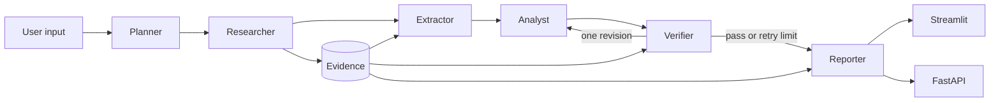

# AI 竞品分析 Agent

一个用于产品调研的 AI Agent 项目。用户输入目标产品、竞品和分析维度后，系统会自动搜索资料、提取产品画像、生成竞品对比、验证引用，最后输出带来源的 Markdown 报告。

这个项目重点不是“让大模型写一篇报告”，而是把竞品分析拆成可测试、可追踪、可验证的 Agent 工作流，适合作为 AI 应用开发实习项目展示。


## 核心亮点

- **多节点 Agent 工作流**：使用 LangGraph 编排 `Planner -> Researcher -> Extractor -> Analyst -> Verifier -> Reporter`。
- **证据驱动分析**：每条事实和结论都绑定 `Evidence ID`，报告中保留可点击来源。
- **结构化输出**：使用 Pydantic 校验 Agent 输入输出，降低模型返回不稳定带来的风险。
- **可靠性设计**：代码负责 URL 去重、引用校验、重试上限、错误降级和确定性报告渲染。
- **真实可运行**：支持 Streamlit 页面、FastAPI 接口、Tavily 搜索和真实 LLM 调用。
- **可复现评测**：默认测试使用离线 fixtures，live 测试单独验证真实模型和搜索服务。

## 技术栈

Python、LangGraph、LangChain、Pydantic、Tavily、Streamlit、FastAPI、pytest。

## 快速开始

需要 Python 3.10–3.13，以及 LLM 和 Tavily 的 API Key。

```powershell
python -m venv .venv
.\.venv\Scripts\python -m pip install -e ".[dev,llm]"
Copy-Item .env.example .env
# 在 .env 中填写 LLM_API_KEY、LLM_BASE_URL、LLM_MODEL 和 TAVILY_API_KEY
.\start.ps1
```

默认测试使用离线 fixtures，不会调用真实服务：

```powershell
.\.venv\Scripts\python -m pytest
```

## 架构



各节点职责清晰分离：Planner 只规划任务，Researcher 只收集证据，Extractor 只提取画像，Analyst 只做对比分析，Verifier 检查引用和语义支持，Reporter 只负责确定性渲染报告。
